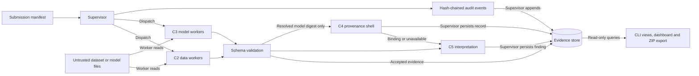

# CV Integrity Assurance
### SIH 2026 · Problem Statement 26228 - Team Genesis Protocol - YASHPAL SINGH RAJWAR 

Offline-first, evidence-first integrity assurance for computer-vision datasets
and model artifacts in multi-contributor pipelines.

**SIH26228 MVP / Demo scope complete.** Evidence remains bounded to tested
fixtures and the accepted target environment—not universal assurance.

| Checkpoint | Status |
|---|---|
| MVP / Demo Gate | COMPLETE |
| Gate-2 / Gate-3 / Gate-4 / Gate-5 | PASS / PASS / PASS / PASS |
| Final non-offline regression | 596 passed / 11 unchanged skips / 0 failed |
| Security | 92 passed / 4 unchanged skips |
| Target | Windows build 22631 / AMD64 / CPython 3.13.12 |
| Operation | Offline-first |
| Dashboard | Read-only / localhost |
| Signing | SIGNING_UNAVAILABLE in approved MVP |

[Run the demo](#one-command-demo) · [Validation evidence](#validation-status) ·
[Claim boundaries](#important-claim-boundaries) · [Documentation](#documentation-index)

## Why This Project Exists

Multi-contributor computer-vision pipelines can receive malformed or corrupted
annotations, exact duplicate data, concentrated contributor data,
substituted or modified model artifacts, unsafe serialized PyTorch artifacts,
and incomplete provenance.

CV Integrity Assurance produces reproducible, structured evidence about these
conditions. It separates observed anomalies, unavailable assessments, missing
coverage and analyst interpretation. It does not claim malware detection or
global model safety.

## What the System Does

| Layer | Component | Bounded operation |
|---|---|---|
| Data integrity | C2A | All-box COCO and approved YOLO detection/segmentation structural and geometry checks |
| Data integrity | C2B | Streaming SHA-256 exact duplicate grouping |
| Data integrity | C2C | Source concentration, HHI and Shannon entropy observations; contributor identity is not authenticated |
| Data integrity | C2D | Image-file SHA-256 byte identity; no image decoding or PDQ implementation |
| Model integrity | C3A | Contained artifact-unit resolution for approved ONNX/PyTorch formats |
| Model integrity | C3B | Deterministic artifact-unit SHA-256 hashing; identity is not behavior |
| Model integrity | C3C | ONNX structure and external-reference containment validation, without model execution |
| Model integrity | C3D | Restricted PyTorch loading with `weights_only=True`; no unsafe fallback |

Governance joins those observations through fail-closed schema validation,
a hash-chained audit trail, reference-health management, an unsigned provenance
shell, explicit deferred-coverage records and C5 structured interpretation.
Analysts inspect evidence through the CLI, a read-only dashboard and ZIP export.

## Architecture



This is logical evidence flow, not live execution telemetry. The supervisor
validates manifests and dispatches workers; it never opens, parses or loads
submitted assets. Workers are untrusted subprocesses, and the supervisor alone
owns evidence persistence and audit writes.

On the accepted Windows target, workers use restricted primary tokens and
configured Job Objects for per-process committed-memory containment; the
supervisor enforces timeout and termination. This is not a whole-host sandbox.
The dashboard is read-only. No external network service is required for the demo.

## One-Command Demo

From the repository root, use the approved **CPython 3.13.12 offline environment**
with its already staged dependencies and provisioned local deployment:

```powershell
python scripts/demo.py --serve
```

The script generates deterministic synthetic assets at seed **26228**, exercises
the real CLI, verifies persisted evidence, produces a valid six-document ZIP,
and starts the loopback dashboard. It prints the dashboard URL; open it manually.
**Ctrl+C** stops presentation mode and reaps the dashboard child.

Two scenarios show the distinction that matters:

- **Benign COCO:** completed geometry evidence and statistics-only interpretation.
- **Missing model:** a contained but deliberately absent PyTorch file produces
  explicit UNAVAILABLE / UNAVAILABLE_NO_DECISION, not a positive assurance state.

For unattended acceptance, including dashboard verification and shutdown:

```powershell
python scripts/demo.py
```

Working files, logs and the ZIP live under ignored `build/demo/<run-id>/`.
Normal supervisor writes append synthetic records to the configured store;
no database, audit history or earlier evidence is cleared. Missing-model
provenance remains C4_BINDING_UNAVAILABLE; an empty provenance array is valid.
The script neither installs packages nor changes networking or signing.
See the [demo guide and 3–5 minute walkthrough](docs/DEMO_GUIDE.md).

## Dashboard

| View | What to inspect |
|---|---|
| Overview | Recorded counts, assessment states and observed pipeline—not confidence or fabricated live telemetry |
| Findings | C5 interpretation, disposition prompts, limitations and non-claims |
| Evidence Explorer | Stored worker signals, identifiers, hashes and available correlations |
| Audit Timeline | Ordered history and explicit CHAIN_CORRUPT status, without reset or diagnostic writes |
| Coverage & Deferred | Method-specific reasons for deferred and unavailable coverage |
| Provenance | Stored bindings and SIGNING_UNAVAILABLE where recorded; no invented signature |

Localhost only, read-only, with no npm, CDN, external fonts or frontend frameworks.
UNAVAILABLE, DEFERRED_IN_SCOPE, CHAIN_CORRUPT and SIGNING_UNAVAILABLE remain
explicit text. There is no risk/confidence score. Missing telemetry or
correlation is disclosed, not fabricated.

Static/CSS visual review and real HTTP/API acceptance passed. Browser-rendered
visual inspection and screenshots are **not** claimed.

## Security Design

- Untrusted dataset/model parsing and loading occur only in worker subprocesses.
- `weights_only=True` is mandatory; there is no unsafe PyTorch fallback.
- Workers re-check path containment, including ONNX external references.
- Windows restricted tokens, Job Object memory limits and supervisor timeouts
  provide the accepted worker boundary—not a whole-host sandbox.
- Supervisor-only evidence persistence and deployment ACL write denial are tested.
- Schema validation and audit writes fail closed; chain tampering is detected
  without destructive reset.
- Analyst views are read-only; inspection does not append audit diagnostics.
- Aggregate risk scores are prohibited. Unavailable/deferred states never become
  clean or positive assurance.

## Validation Status

Accepted final MVP checkpoint results; skips are retained and are not passes.

| Validation | Result |
|---|---|
| Gate-5 focused | 8 passed |
| Dashboard | 27 passed |
| CLI | 9 passed |
| Exporter | 27 passed |
| SEC-010 audit corruption | 1 passed |
| Security | 92 passed, 4 unchanged skips |
| Integration + negative | 115 passed, 4 unchanged skips |
| Non-offline regression | 596 passed, 11 unchanged skips, 0 failed |
| Real automated demo | PASS, exit 0 |

See the [Gate-5 acceptance record](docs/validation/gate5_demo_acceptance.md),
[Gate-4 evaluation](docs/validation/task026_gate4_evaluation.md) and
[current project status](PROJECT_STATUS.md) for criteria, raw evidence
references, historical results and exact limitations.

## Offline Target

The frozen accepted tuple is **Windows build 22631 / AMD64 / CPython 3.13.12 /
16 GB RAM**. Target-host offline validation is bounded to that environment and
the staged dependency set, not a portable deployment guarantee.

OFF-002 recorded **zero non-loopback egress during its accepted measurement
window**. Its historical recovery marker **FAIL** and independent restored-state
**PASS** remain separate facts. See the
[OFF-002 reconciliation](docs/task027s_off002_reconciliation.md) and
[complete accepted-evidence review](docs/validation/task026_gate4_evaluation.md).
Running the demo is not a new OFF-002 packet-capture test.

## Repository Structure

```text
assurance_system/
  config/           YAML configuration and fail-closed loader
  workers/          Isolated C2/C3 assessment workers
  supervisor/       Orchestration, validation and evidence governance
  interfaces/       Analyst CLI and read-only dashboard
  export/           Six-document evidence ZIP packaging
  fixtures/         Seed-pinned synthetic fixture generators
  schema/           Frozen JSON evidence contracts
artifact_unit_defs/ Approved artifact membership definitions
scripts/            Demo and offline validation tooling
tests/              Unit, integration, negative, security and offline tests
docs/               Specifications, acceptance evidence and research
wheelhouse/         Local staged dependencies; ignored by Git
```

## Documentation Index

- [Architecture specification](docs/ARCHITECTURE_SPECIFICATION.md)
- [Technical specification](docs/TECHNICAL_SPECIFICATION.md)
- [MVP implementation plan](docs/MVP_IMPLEMENTATION_PLAN.md)
- [Public project status](PROJECT_STATUS.md) · [Live implementation state](PROJECT_STATE.md)
- [Demo guide](docs/DEMO_GUIDE.md)
- [Gate-5 acceptance](docs/validation/gate5_demo_acceptance.md)
- [Third-party attribution](NOTICES.md)
- [Evaluator-facing C1–C6 research dossiers](docs/research/)

## Important Claim Boundaries

This project does **not** claim:

- malware detection, complete integrity assurance or model safety;
- global backdoor absence or behavioral equivalence;
- causal execution proof: digest match does not establish causal execution (PF-002);
- T05d clean-label poisoning detection—a permanent non-claim;
- verified reference health when unavailable;
- operational signing when SIGNING_UNAVAILABLE.

An anomaly is not proof of malicious intent. UNAVAILABLE and DEFERRED_IN_SCOPE
are not positive assurance states. Exact byte identity, successful restricted
loading and finite fixture tests do not establish broader behavioral properties.

## Post-MVP / Deferred

- PRE-08 operational signing provisioning; the approved MVP remains unsigned.
- Historical HOST-CAP-003 procedural re-entry; factual ONNX runtime capability is PASS.
- Explicitly deferred research/methods, retained in coverage records.

These do not invalidate the accepted SIH MVP / Demo Gate. They are not declared
complete, and T05d is not a promised future detection capability.

## Attribution

R17 storage-pattern and R27 pycocotools attributions are recorded in
[NOTICES.md](NOTICES.md). No project license is declared here; no root LICENSE
has been added without an owner licensing decision.
